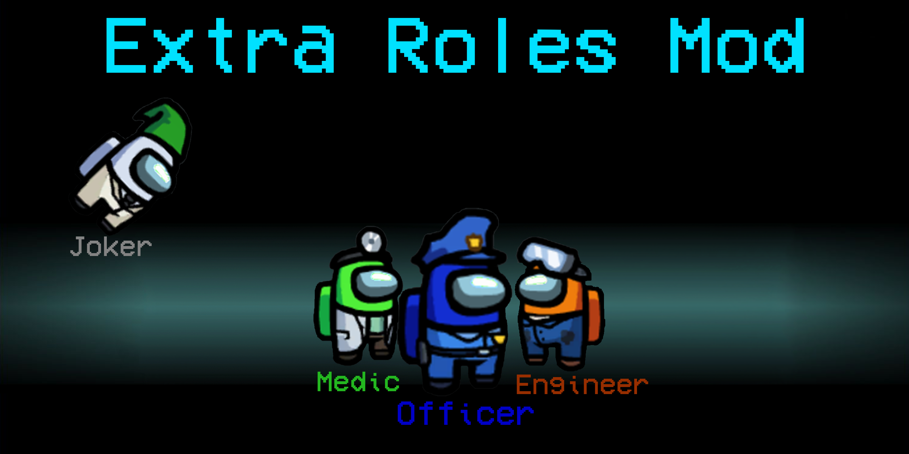

# Extra Roles
A BepInEx mod for Among Us that adds 4 new roles into the game.

# Notice
This mod will work on Innersloth servers, but everybody in the lobby has to have the same version of the mod. For help with installing the mod, getting it to work, or fixing an issue, join the [Discord](https://discord.gg/f8Yv2Tawcg).

# What does the mod add?

## Medic
The Medic can give any player a shield that will make them immortal. Although, if The Medic dies, the shield will break.  
The only exception is The Officer; they will still die if they try to kill a Crewmate.  
The Medic's other feature shows when they find a corpse: they can get a report that contains clues to the killer's identity.  
The type of information they get is based on a timer that can be configured inside the host's config file. 
  
## Officer
The Officer is a class of Crewmate that is allowed to kill people, similar to Impostors.  
Their goal is to locate the Impostor and deliver vigilante justice, but if they accidentally shoot a Crewmate, they die instead.  
  
## Engineer
The Engineer can repair one emergency per game from anywhere on the entire map.  
The other ablity of The Engineer is that they are able to use the vents that were previously exclusive to Impostors.  

## Joker
The Joker is interesting; they aren't part of the Crewmates **or** Impostors, and they can only win by being falsely convicted as an Impostor.  
If The Joker get's voted off the ship, the game will end instantly.  
The Joker also has no tasks.  

# Installation

Here's a quick video if you can't be bothered to read the steps: https://youtu.be/gtuqYsdir_k  
For the rest of you, here's the installation instructions.  
  
## Instructions
  
1) Download the latest release from the releases tab.
2) If you do not have WinRar, install it from here: https://www.rarlab.com/
3) Once WinRar is installed, open the .rar file you downloaded from the releases tab.
4) Go to the Among Us install directory. On Steam, right click the game, hover over manage, and click "Browse Local Files"
4) Drag every single file inside the downloaded .rar into your Among Us directory. (The folder that contains Among Us.exe)
5) Run the game. The mod will take pretty long to start the first time, but after that, it will start at about the same speed.
6) To verify the mod is installed, look at the text in the top left of the menu screen.
7) Make sure it says "Mods: 3" and "Extra Roles Mod vX.X.X Loaded." (X.X.X being the current version number)

# Game Options
  
## Show Medic
*Default: false* 
This is the game setting that toggles wether the Medic's name is lit up green for everybody in the game, or just themselves.
  
## Show Shielded Player
*Default: true* 
When The Medic shield's somebody, their visor will change to the color cyan. If this setting is set to 1, everybody can see the color change. If not, only the shielded player can see.
  
## Murder Attempt Indicator For Shielded Player
*Default: true* 
If this setting is enabled, the shielded player will hear a *ting* noise when somebody tries (and fails) to murder them.
  
## Show Officer
*Default: false* 
If this setting is enabled, The Officer's name will be lit up blue for everyone. If it isn't, it will only be lit for themselves.
  
## Officer Kill Cooldown
*Default: 30* 
This is the kill cooldown length for The Officer. The first cooldown on the first round will be equal to ten no matter what, just like the Impostor.
  
## Show Engineer
*Default: false* 
If this setting is enabled, The Engineer's name will be lit up orange for everyone. If it isn't, it will only be lit for themselves.
  
## Show Joker
*Default: false* 
If this setting is enabled, The Jokers's name will be lit up grey for everyone. If it isn't, it will only be lit for themselves.
  
## Joker Can Die To Officer
*Default: true* 
If this setting is enabled, The Officer will be able to kill The Joker without reprecussion. If it's disabled, killing The Joker will execute as if they were a Crewmate.
  
### Time Where Medic Reports Will Have Name
*Default: 5* 
The amount of time (in seconds) that The Medic will have to report the body since death to get the killer's name.

## Time Where Medic Reports Will Have Color Type
*Default: 20* 
The amount of time (in seconds) that The Medic will have to report the body since death to get the killer's color type.  
"color type" means either "lighter" or "darker", and a full list of colors and their types are included at the bottom of the page.  
  
## Medic Spawn Chance
*Default: 100* 
The percentage chance that anybody in the game will become The Medic.  
  
## Officer Spawn Chance
*Default: 100* 
The percentage chance that anybody in the game will become The Officer.  
  
## Engineer Spawn Chance
*Default: 100* 
The percentage chance that anybody in the game will become The Engineer.  
  
## Joker Spawn Chance
*Default: 100* 
The percentage chance that anybody in the game will become The Joker.  

# Color Types
Red is darker.  
Blue is darker.  
Green is darker.  
Pink is lighter.  
Orange is lighter.  
Yellow is lighter.  
Grey is darker.  
White is lighter.  
Purple is darker.  
Brown is darker.  
Cyan is lighter.  
Lime is lighter.  

# Bugs or feature suggestions
If you ever need to talk to someone for help fixing an issue, want to report a bug, or suggest a feature, do not hesitate to join the mod [Discord Server](https://discord.gg/f8Yv2Tawcg).
 
# Resources
https://github.com/NuclearPowered/Reactor The framework the mod uses.  
https://github.com/BepInEx For hooking game functions.  
https://github.com/Impostor/Impostor For running a non-official server. (if you wish)  
https://github.com/DorCoMaNdO/Reactor-Essentials For creating custom game options easily.  
https://github.com/Woodi-dev/Among-Us-Sheriff-Mod For code snippets.  
https://github.com/tomozbot/SweeperMod For code snippets.  
