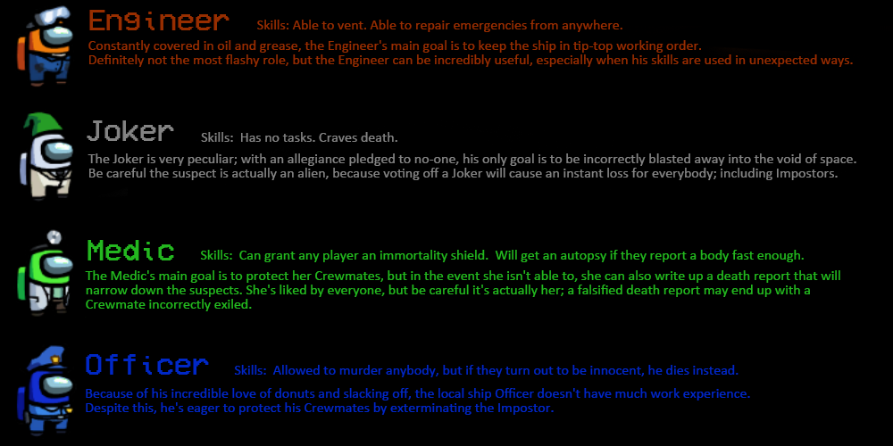

# Extra Roles
A BepInEx mod for Among Us that adds 4 new roles into the game. This mod cannot be played on Innersloth servers.

# Notice
Make sure your server region in the online menu is set to 'Custom', or else the game will not function properly.

# Credits
https://github.com/NuclearPowered/Reactor The framework the mod uses.  
https://github.com/BepInEx For hooking game functions.  
https://github.com/Woodi-dev/Among-Us-Sheriff-Mod For code snippets.  
https://github.com/tomozbot/SweeperMod For code snippets.  
https://github.com/NotHunter101/Impostor My fork of Impostor that the mod needs to run.  
https://github.com/Hiumee/Impostor The fork of Impostor that can repair sabotages programmatically.  

